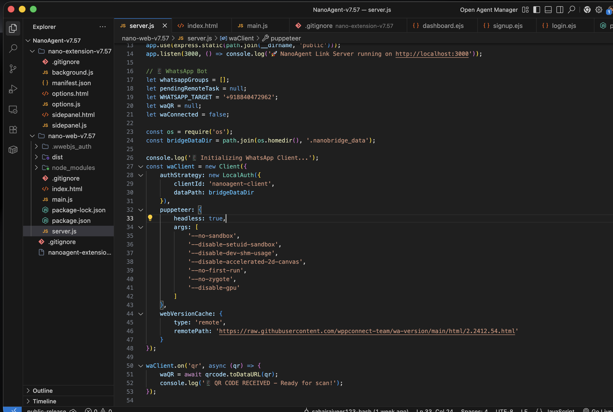

<p align="center">
  
</p>

<h1 align="center"> NanoAgent — Autonomous Browser AI</h1>

<p align="center">
  <em>An open-source, LLM-powered Chrome extension that sees, thinks, and acts on the web for you.</em>
</p>

<p align="center">
  <a href="https://nanoagent.vercel.app/"></a>
  
  
  
  
  
</p>

<p align="center">
  <a href="https://nanoagent.vercel.app/"><strong>🌐 Visit Website</strong></a> · 
  <a href="#-features">Features</a> · 
  <a href="#-quick-start">Quick Start</a> · 
  <a href="#-screenshots">Screenshots</a> ·
  <a href="#%EF%B8%8F-architecture">Architecture</a> ·
  <a href="#-whatsapp-remote-control">WhatsApp Remote</a> ·
  <a href="#-supported-providers">Providers</a> ·
  <a href="#-contributing">Contributing</a>
</p>

---

## 🌐 Website

**👉 [nanoagent.vercel.app](https://nanoagent.vercel.app/)**

Visit the official NanoAgent website to learn more, see live demos, and get started.

---

## What is NanoAgent?

NanoAgent is a **fully autonomous web agent** that lives inside your Chrome browser's side panel. Give it a task in plain English, and it will:

- 🔍 **See** — Scan and understand every element on the current webpage
- 🧭 **Navigate** — Click buttons, fill forms, switch tabs, and browse the internet
- 📝 **Extract** — Pull data from pages and compile structured results
- 💬 **Remember** — Maintain context across multi-step tasks
- 📱 **Remote Execute** — Accept commands via WhatsApp from your phone

> **Think of it as an AI intern that can use Chrome just like you do — reading pages, clicking links, typing into search bars, and reporting back with answers.**

---

## 🎬 See It In Action

https://github.com/user-attachments/assets/ff0c2171-3298-43f8-8c1e-8633286a4755.mp4

---

## ✨ Features

| Feature | Description |
|---------|-------------|
|  **Dual-Brain Architecture** | Separate Planner (reasoning) and Navigator (action) models for superior task execution |
|  **Universal LLM Support** | Works with Gemini, OpenAI, OpenRouter, DeepSeek, Groq, Ollama, LM Studio, and any OpenAI-compatible provider |
|  **DOM Vision Engine** | Reads and indexes interactive page elements in real-time for precise actions |
|  **Multi-Tab Navigation** | Seamlessly switches between tabs to gather information across multiple pages |
|  **Persistent Memory** | Stores extracted data across steps and compiles final results |
|  **WhatsApp Remote Control** | Send commands from your phone, get results delivered back via WhatsApp |
|  **Auto-Retry & Self-Healing** | Gracefully handles API errors, rate limits, and failed actions with automatic retries |
|  **Privacy-First** | All processing happens locally in your browser. No data leaves your machine except LLM API calls |
|  **Beautiful Dark UI** | Sleek, modern sidepanel interface with real-time execution logs |

---

##  Quick Start

### 1. Download & Install

```bash
# Clone the repository
git clone https://github.com/Rajveer-sahay985/NanoAgent_LLM-Based_Agentic_Al.git

# Navigate to the project
cd NanoAgent_LLM-Based_Agentic_Al
```

### 2. Load the Extension in Chrome

1. Open Chrome and go to `chrome://extensions/`
2. Enable **Developer Mode** (toggle in top-right)
3. Click **"Load Unpacked"**
4. Select the `nano-extension-v7.57` folder
5. Pin NanoAgent to your toolbar

### 3. Configure Your LLM

1. Right-click the NanoAgent icon → **Options**
2. Choose your API provider (Gemini, OpenAI, OpenRouter, etc.)
3. Paste your API key
4. Click **"⚡ Load Available Models"** to auto-discover models
5. Select a **Planner** model and a **Navigator** model
6. Click **"Save Brain Configuration"**

### 4. Start Using NanoAgent

1. Click the NanoAgent icon to open the **sidepanel**
2. Type your task in plain English:
   - *"Find the current price of Bitcoin"*
   - *"Go to Amazon and find the cheapest MacBook Air"*
   - *"Search YouTube for the latest video by Markiplier and tell me the title"*
3. Click **▶ Start** and watch the AI work!

---

##  Screenshots

<p align="center">
  
  &nbsp;&nbsp;&nbsp;
  
</p>

---

## ⚙️ Architecture

NanoAgent uses a **Dual-Brain Architecture** — two separate LLM instances working in tandem:

```
┌─────────────────────────────────────────────┐
│                 USER PROMPT                  │
│          "Find the price of gold"            │
└──────────────────┬──────────────────────────┘
                   │
         ┌─────────▼──────────┐
         │    PLANNER LLM   │ ← Decides WHAT to do
         │  (Task Reasoning)  │    "I need to Google this"
         └─────────┬──────────┘
                   │
         ┌─────────▼──────────┐
         │   NAVIGATOR LLM  │ ← Decides HOW to do it
         │   (DOM Actions)    │    "Click element [3], type query"
         └─────────┬──────────┘
                   │
         ┌─────────▼──────────┐
         │   CHROME BROWSER  │ ← Executes the action
         │  (Content Script)  │    Clicks, types, navigates
         └─────────┬──────────┘
                   │
              ┌────▼────┐
              │ RESULTS  │ → Displayed in sidepanel
              └──────────┘    or sent to WhatsApp
```

---

## 📱 WhatsApp Remote Control

NanoAgent includes an optional **WhatsApp Remote Control** feature. This lets you send commands to your browser agent directly from your phone.

### How it works

1. Download and run the **NanoBridge** companion app (included in `nano-web-v7.57/`)
2. Scan the QR code in the Extension's **Options** page or the NanoBridge desktop window
3. Send a message starting with `/nanoagent` from your linked WhatsApp:

```
/nanoagent what is the current price of ethereum
```

4. NanoAgent executes the task in Chrome and sends you the results back via WhatsApp! 💬

> **Note:** The WhatsApp bridge requires the NanoBridge companion app to be running locally. See the [NanoBridge Setup](#nanobridge-setup) section below.

### NanoBridge Setup

```bash
cd nano-web-v7.57
npm install
node server.js
```

Or use the pre-built macOS app from the `dist/` folder.

---

##  Supported Providers

NanoAgent works with **any OpenAI-compatible API endpoint**, plus native Gemini support:

| Provider | Type | Cost |
|----------|------|------|
| **Google Gemini** | Native | Free tier available |
| **OpenRouter** | OpenAI-compatible | Free models available |
| **OpenAI / ChatGPT** | OpenAI-compatible | Paid |
| **DeepSeek** | OpenAI-compatible | Very cheap |
| **Groq** | OpenAI-compatible | Free tier available |
| **Ollama** (local) | OpenAI-compatible | Free (runs on your machine) |
| **LM Studio** (local) | OpenAI-compatible | Free (runs on your machine) |

### Recommended Free Setup

For zero-cost usage, use **OpenRouter** with free models:
1. Sign up at [openrouter.ai](https://openrouter.ai)
2. Get a free API key
3. Set Base URL to: `https://openrouter.ai/api/v1/chat/completions`
4. Select free models like `google/gemma-3-12b-it:free`

---

##  Project Structure

```
NanoAgent/
├── nano-extension-v7.57/     # Chrome Extension (load this in chrome://extensions)
│   ├── manifest.json         # Extension manifest (MV3)
│   ├── background.js         # Service worker
│   ├── sidepanel.html/js     # Main agent UI + execution engine
│   └── options.html/js       # Settings page with LLM + WhatsApp config
│
├── nano-web-v7.57/           # NanoBridge — WhatsApp companion server
│   ├── server.js             # Express + WhatsApp-Web.js bridge
│   ├── main.js               # Electron wrapper for desktop app
│   ├── index.html            # Desktop app UI
│   └── package.json          # Dependencies & build config
│
├── assets/                   # Screenshots & logo
└── README.md                 # You are here
```

---

##  Privacy & Security

- **No data collection.** NanoAgent does not send any data to any server other than your chosen LLM API.
- **API keys are stored locally** in Chrome's `chrome.storage.sync` — they never leave your browser.
- **No analytics, no tracking, no telemetry.**
- **Open source.** Every line of code is auditable right here.

---

##  Contributing

Contributions are welcome! Feel free to:

1.  Fork the repository
2.  Create a feature branch (`git checkout -b feature/amazing-feature`)
3.  Commit your changes (`git commit -m 'Add amazing feature'`)
4.  Push to the branch (`git push origin feature/amazing-feature`)
5.  Open a Pull Request

---

##  License
This project is licensed under a **Custom License (Attribution-NonCommercial)** — see the [LICENSE](LICENSE) file for details. You may use, modify, and distribute this software with proper attribution, but commercial use and resale are strictly prohibited.

---

##  Author

**Rajveer Sahay**  
Built with ☕ and curiosity.

---

<p align="center">
  <sub>If NanoAgent helped you, consider giving it a ⭐ on GitHub!</sub>
</p>
